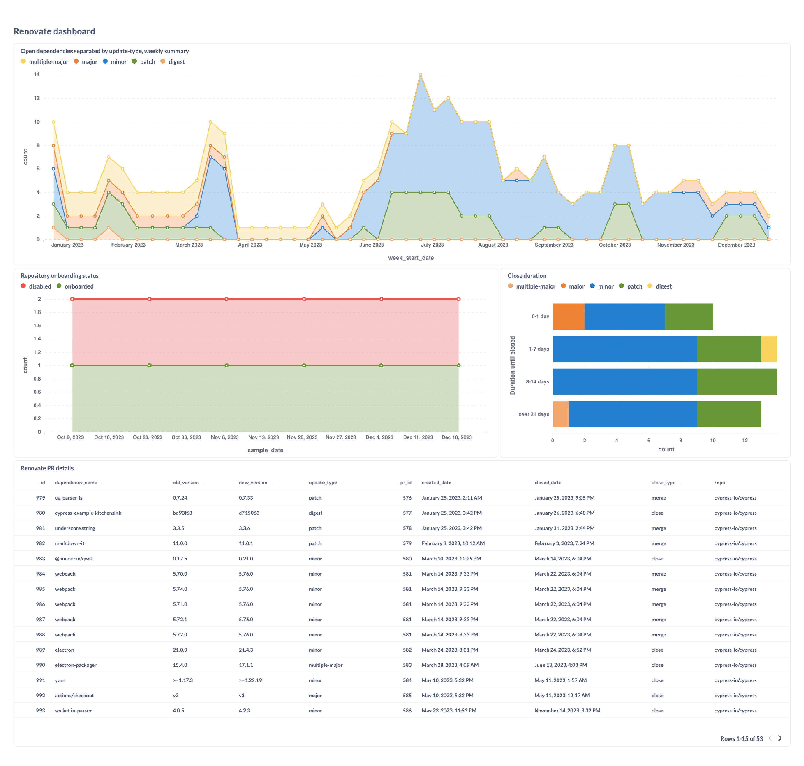
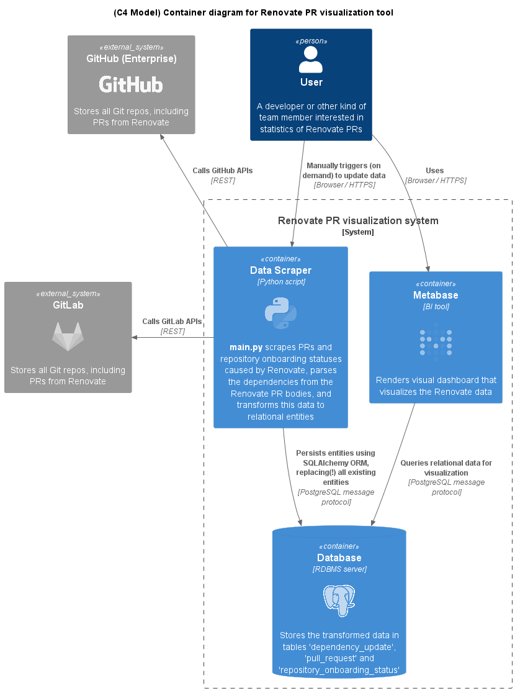
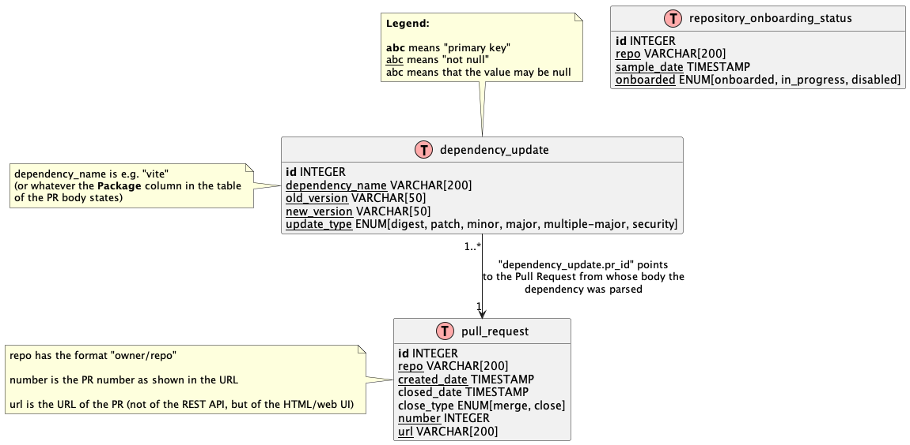

# Renovate PR visualization

This is a turn key solution that visualizes your [Renovate Bot](https://docs.renovatebot.com/) Pull Requests (your "technical debt") of your **GitHub** repositories (for now, only GitHub is supported).

All you need to do is provide a few configuration values and run `docker compose up` to get access to a dashboard that looks as follows:



The above screenshot shows the state of the [cypress](https://github.com/cypress-io/cypress) repository as of 2023-12-19 (note: the dashboard comes with _filters_ for the start and end date, and for choosing a specific repository, the filters are not shown in the screenshot):
- The **top** graph shows the number of open Renovate PRs over time, with one sample point per week (Monday at UTC midnight), grouped by the type of dependency update (e.g. "major", "minor", "patch", "digest", "security")
- The **left center** graph is meaningless for _individual_ repositories: it is meant to be used in case you instruct the tool to scrape _many_ repositories, and you want to know the Renovate onboarding status of the repositories, over time:
  - "onboarded": if there is a `renovate.json[5]` file in the root of the repo's default branch
  - "onboarding": if there is a "Configure Renovate" PR open
  - "disabled": if both "onboarded" and "onboarding" are false
- The **right center** graph shows the average time it took to close a Renovate PR
- The **bottom** graph is simply a tabular view into the database

## Why do I need this?

Renovate creates Pull Request for outdated dependencies, which are a form of technical debt. Knowing how much technical debt you have is important to make informed decisions about how to prioritize your work.

Using this tool will improve your understanding regarding:

- how your technical debt has _evolved over time_: for instance, if the number (or severity) of the PRs keeps increasing, you may want to consider granting your development team a larger "budget" for updating outdated dependencies
- how long does it take the development team to address (that is, close) Renovate PRs, on average
- in case you have _many_ repositories: how many of them have been onboarded to Renovate, how has this changed over time

## How it works



This tool comes with a preconfigured **Docker compose** setup that uses [Metabase](https://www.metabase.com/) to draw a dashboard that visualizes your Renovate Pull Requests. But you could use any other "business intelligence" tool of your choice, or replace the PostgreSQL database with another relational database. The most complex SQL query is the one that computes how many PRs are open at a given point in time:

<details>
  <summary>Example for SQL query</summary>

```sql
WITH weekly_dates AS (SELECT generate_series(
                                     date_trunc('week', TIMESTAMP '2023-09-25'),
                                     date_trunc('week', CURRENT_DATE),
                                     '1 week'::interval
                                 ) AS week_start_date),
     update_types AS (SELECT DISTINCT update_type FROM dependency_update),
     week_priorities AS (SELECT week_start_date, update_type
                         FROM weekly_dates CROSS JOIN update_types),
     open_prs AS (SELECT date_trunc('week', created_date) AS week_created,
                             date_trunc('week', COALESCE(closed_date, CURRENT_DATE + INTERVAL '10 years')) AS week_closed,
                             update_type, repo
                      FROM deps_with_prs_view)
SELECT wp.week_start_date,
       wp.update_type,
       COUNT(open_prs.week_created)
FROM week_priorities wp
         LEFT JOIN open_prs
                   ON wp.week_start_date BETWEEN open_prs.week_created AND open_prs.week_closed
                       AND wp.update_type = open_prs.update_type AND open_prs.repo = 'owner/repo'
GROUP BY wp.week_start_date, wp.update_type
ORDER BY wp.week_start_date, wp.update_type;
```
Note that you need to replace the timestamps in rows 2+ 3 and the `owner/repo` at the bottom.
</details>

The database model looks as follows:



## Usage instructions

> **⚠️ Prerequisites:** Using this tool only makes sense if Renovate has been running in your repositories _for a while_ (e.g. several weeks, better months). Otherwise, the dashboard won't show much data.
> 
> Your Renovate configuration should contain the following settings:
> - The tool needs a clear way to identify the PRs created by Renovate
>   - PRs could be created by a specific functional user (on GitHub **.com** this is`renovate[bot]`)
>   - You could assign a _label_ to the PRs (in your `renovate.json` file, set `labels` e.g. to `["dependencies"]`)
> - The tool needs a clear way to identify **security** PRs, e.g. by putting the following snippet into your `renovate.json` file:
>   ```json
>   "vulnerabilityAlerts": {
>        "labels": ["security", "dependencies"],
>   }
>   ```

To run this tool, follow these steps:
- Create a copy of the `.env.example` file (name it `.env`), and change the configuration values, which are documented in the file
- Run `docker compose up -d`, wait for the `datascraper` service/container to finish with exit code 0 (if exit code is 1, inspect the container logs for errors)
- Open Metabase at http://localhost:3000, login with username `admin@site.org` and password `admin1!`, then navigate to the **Renovate dashboard**. This dashboard shows the data of _all_ Git repositories, but the _Repository_ filter at the top of the dashboard allows you to filter the entries down to a specific repository.
- Whenever you want to update the Renovate data, run `docker compose up datascraper` again
